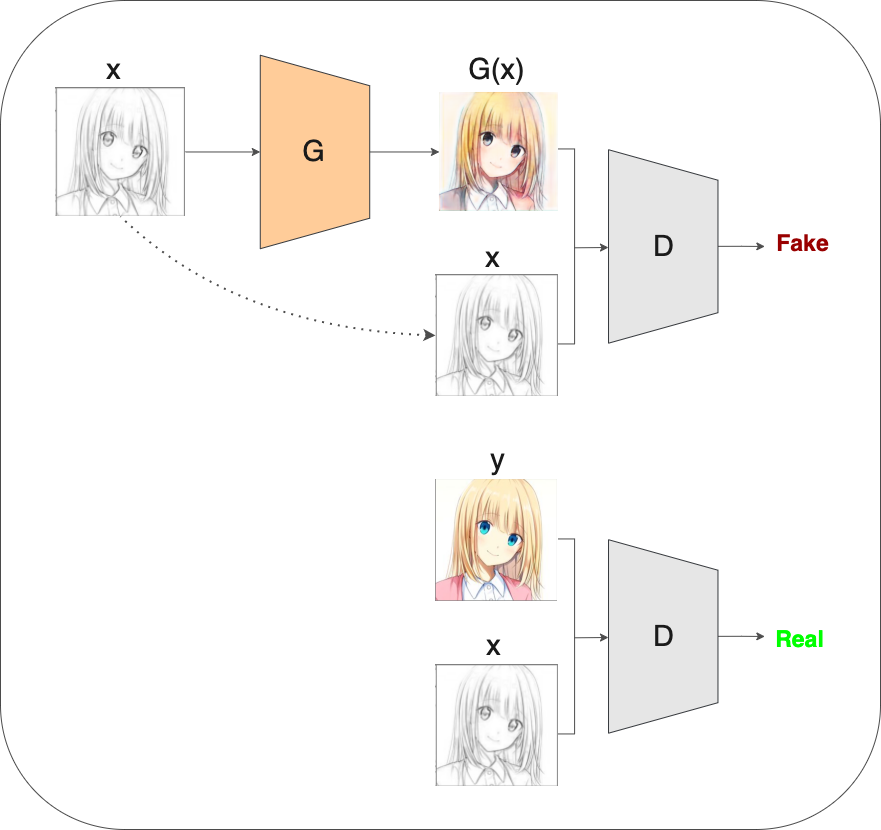
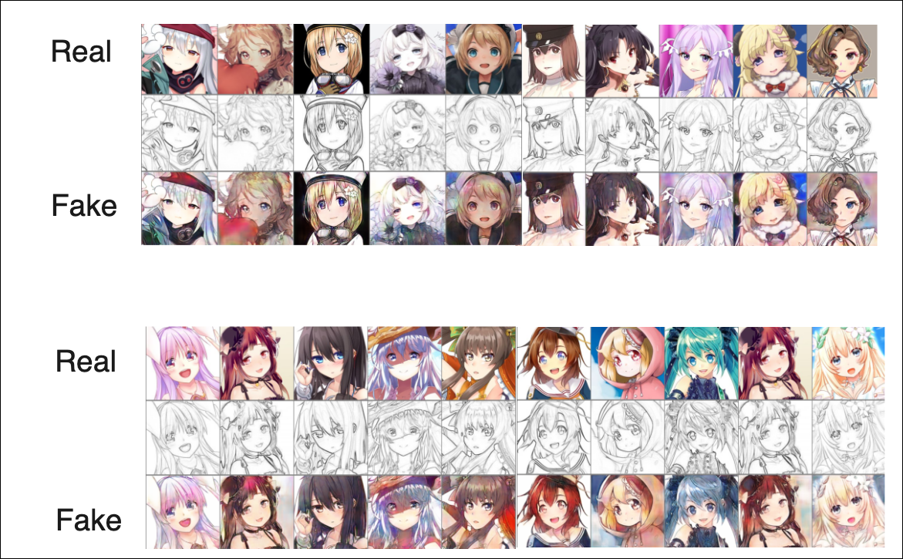
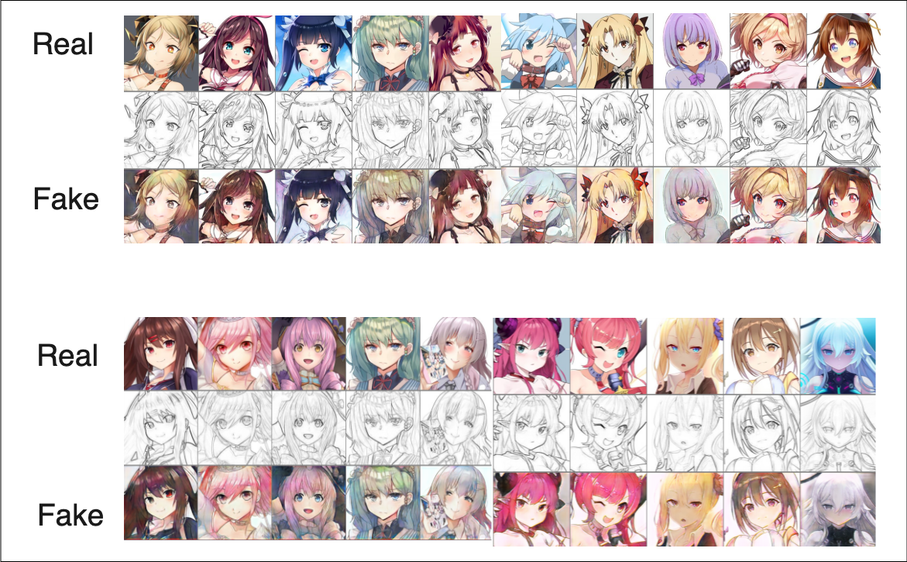

# AnimeFace-simple_pix2pix

This repository experiments(PyTorch) with [AnimeFace datasets](https://www.kaggle.com/scribbless/another-anime-face-dataset) in pix2pix for line art coloring.  
  
<div align="center">
  
</div>


<br>


## requirements
- Python, numpy
- PyTorch
- torchvision


## Usage

The first argument is the path to the dataset containing the images `<img_dir>` and a recognizable model_name for simple experiment management `<identifiable name>`.   

Also, the dataset directory structure should look like this
```
<img_dir>
 |
 |>train
 |
 |>test
```

<br>

Let's start learning
```
$ python train.py --input_path <img_dir> --model_name <identifiable name>
```
<br>


If you want to start training from the middle, specify the mode_name(`<identifiable name>`)  to be continued and give the argument. `--continue_train` .

```
python train.py --input_path <img_dir> --model_name <identifiable name> --continue_train
```

<br>

The following are the results of coloration generation by inputting test data into the Generator, which has been trained up to Epoch 65






<br>

***

